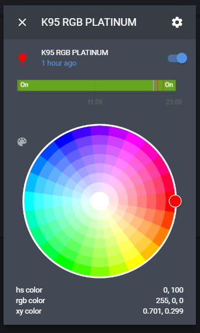

# icue2mqtt 
Corsair iCUE MQTT client for Home Assistant

*Project Description*

A C# .NET core Windows service, allowing Home Assistant to discover and control the LED color of Corsair iCUE devices installed on the host system over MQTT. Each iCUE device will be discovered as a separate RGB LED light bulb.

*prerequisites*

* to build: .Net core SDK https://download.visualstudio.microsoft.com/download/pr/854ca330-4414-4141-9be8-5da3c4be8d04/3792eafd60099b3050313f2edfd31805/dotnet-sdk-3.1.101-win-x64.exe
* to run: .NET core 3.1 runtime https://download.visualstudio.microsoft.com/download/pr/a1d41522-4da0-42bc-b3f2-e4b7d842974d/03101425368c87c55c1fe7cafbb4e0fb/windowsdesktop-runtime-3.1.1-win-x64.exe

*Installing*

there is currently no installers. The repository will need to be cloned and built/installed manually:
* Run PowerShell as administrator
* CD to the icue2mqtt directory of the cloned repository
* Run "dotnet publish -r win-x64 -c Release"
* Open the icue2mqtt/bin/release/netcoreapp3.1/win-x64/publish directory
* Copy all the files to a suitable deployment directory for the following points we will assume this is C:\icue2mqttRelease
* Edit the C:\icue2mqttRelease\properties.json in a suitable text editor
* Set the mqttUrl property value to the IP of your MQTT broker
* If you MQTT server requires authentication then 
* CD to the deployment directory set the mqttCredentialsUser and mqttCredentialsPwd property values
* Run "sc.exe create icue2mqttService BinPath=C:\icue2mqttRelease\icue2mqtt.exe" in admin PowerShell this will set up a service
* Go to run>services.msc
* Locate the icue2mqttService and double click it
* Change the Startup type to "Automatic (Delayed Start)"
* Start the service
* click Apply
* Click OK

*Home Assistant*

You will need a MQTT broker. This has been tested with Mosquitto broker on Hass.io
Discovered devices will be listed under integrations>MQTT:<IP> Each iCUE device will be named with the device type and have the entity ID of light.device_type_with_spaces_as_underscores.
  

*Tested iCUE Devices*

* K95 RGB Platinum
* VOID Wireless headphones
* Commander Pro
* Should work with any Corsair devices compatible with the SDK

*Limitations*

* Once the device has been updated by Home Assistant, the iCUE software will not be able to update the color until the service is stopped. I plan to add a switch device to allow control to be relinquished in the future.
* When the PC starts up, the iCUE server takes a while to start. The service will re-try to connect every 10 seconds until successful and therefore may not be instantly available.
* When getting the state, the color returned for a device is the average values for R, G, B across all the LEDs on the device as iCUE LEs might all have different colors
* Designed to control an entire device, setting a unified color not able to control each LED individually.

*TODO*

* Allow Home Assistant to relinquish control to iCUE software
* Profile switching using unoficial games SDK
* More error logging
* Add self installing banaries

*Suggestions*

Please feel free to give feedback or feature requests

*Thanks*

https://dotnetcoretutorials.com/2019/09/19/creating-windows-services-in-net-core-part-1-the-microsoft-way/
https://github.com/AndrewBabbitt97/CUESDK.NET

